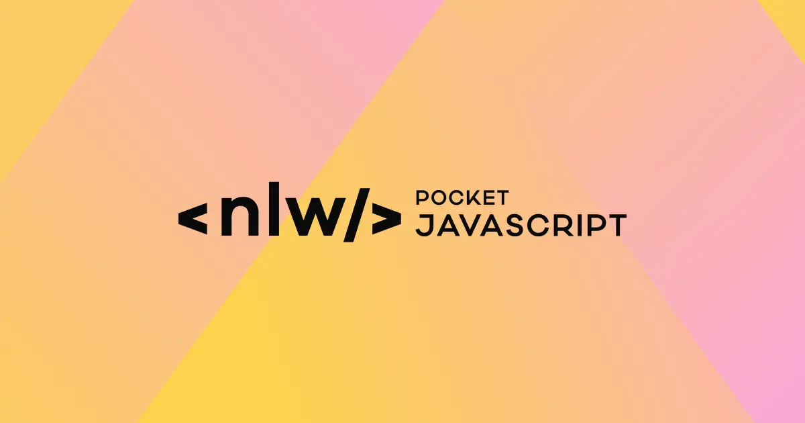
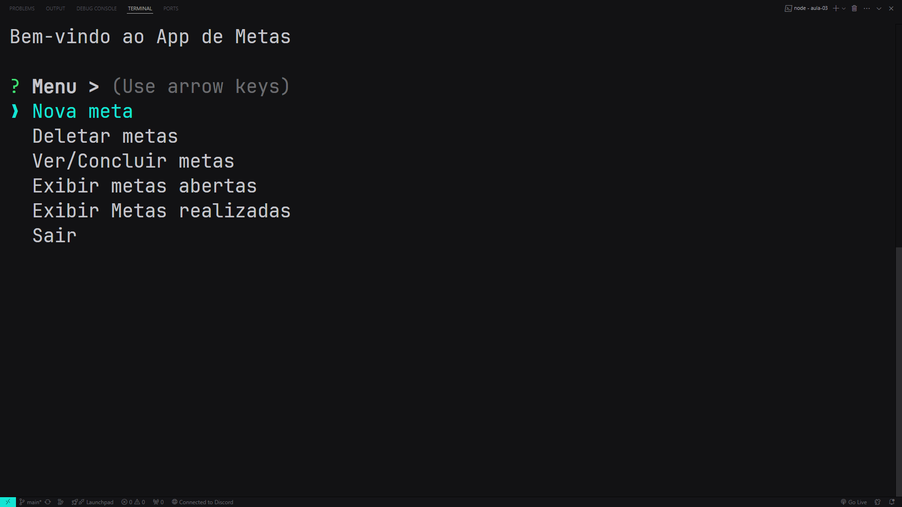
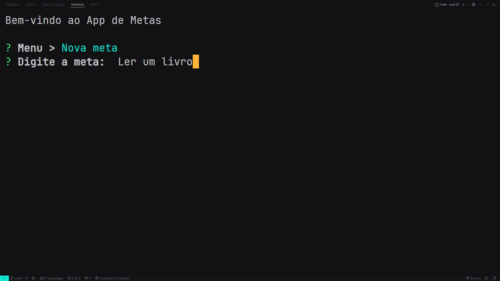
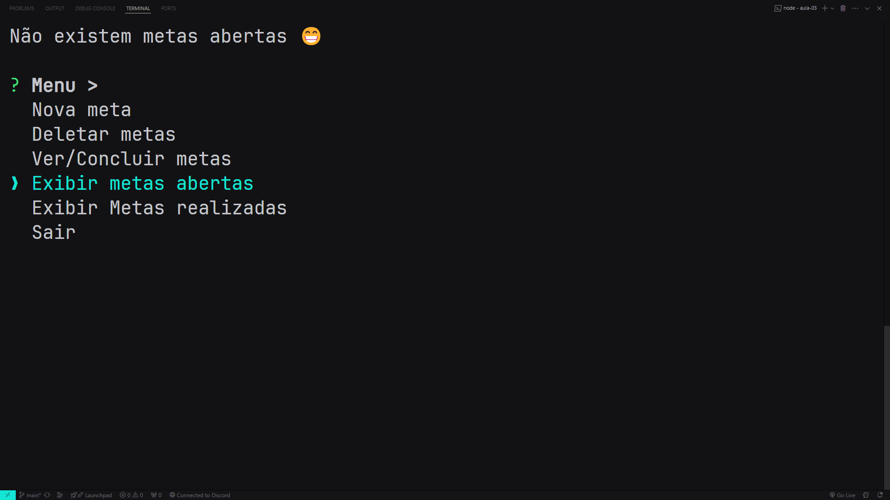
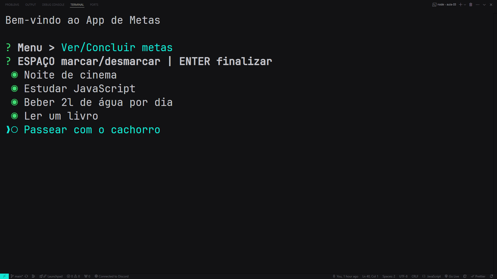

<h1>NLW Pocket JavaScript</h1>

Um Gerenciador de Metas desenvolvido em JavaScript e Node.js durante a trilha Programação Iniciante da NLW Pocket JavaScript da Rocketseat.

## Preview

## Tecnologias

- JavaScript
- Node.js
- JSON
